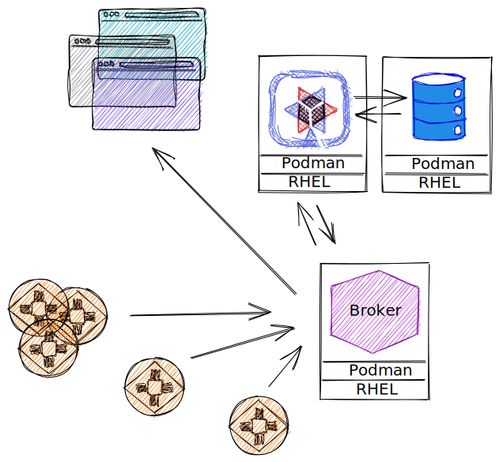
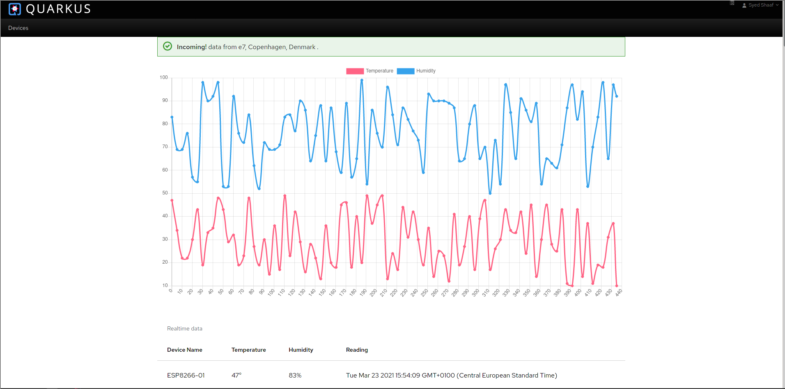

# quarkus-edge-mqtt project

This project uses Quarkus, the Supersonic Subatomic Java Framework.

If you want to learn more about Quarkus, please visit its website: https://quarkus.io/ .

## High level Architecture



## Components

### Quarkus SmallRye Messaging and RESTEasy extensions
SmallRye Reactive Messaging is a framework for building event-driven, data streaming, and event-sourcing applications using CDI. 
It lets your application interaction using various messaging technologies such as Apache Kafka, AMQP or MQTT. 
The framework provides a flexible programming model bridging CDI and event-driven.
[SmallRye Messaging](https://smallrye.io/smallrye-reactive-messaging/smallrye-reactive-messaging/2/index.html)

I also used the quickstarts for inspiration and understanding the basics [Quarkus quickstarts](https://github.com/quarkusio/quarkus-quickstarts)
And the accompanying [guides](https://quarkus.io/guides/)

Maven dependencies as follows
```
    <dependency>
      <groupId>io.quarkus</groupId>
      <artifactId>quarkus-smallrye-reactive-messaging-mqtt</artifactId>
    </dependency>
    <dependency>
      <groupId>io.quarkus</groupId>
      <artifactId>quarkus-arc</artifactId>
    </dependency>
    <dependency>
      <groupId>io.quarkus</groupId>
      <artifactId>quarkus-resteasy</artifactId>
    </dependency>
```

### RHEL (Red Hat Enterprise Linux)
This demo was created on RHEL, but this should not stop anyone from running it anywhere else. 
I used both the RHEL for Arm64 and also X86. 

### Podman
What is Podman? Podman is a daemonless container engine for developing, managing, and running OCI Containers on your System. 
Containers can either be run as root or in rootless mode.
More on Podman [here](https://podman.io/getting-started/)


### Mosquitto
Eclipse Mosquitto is an open source (EPL/EDL licensed) message broker that implements the MQTT protocol versions 5.0, 3.1.1 and 3.1. 
Mosquitto is lightweight and is suitable for use on all devices from low power single board computers to full servers.
We use it in this demo for a basic and simple MQTT broker

To start mosquitto before you use this project use the following command 

```
podman run --name mosquitto \
--rm -p "9001:9001" -p "1883:1883" \
eclipse-mosquitto:1.6.2
```

### Devices
The device in this case an emulated one ESP2866-1 that throws Temperature and heat as a Json into the MQTT broker.
That is then picked up as a reactive channel and throws that data out after processing into the stream. 
The stream is read by the browser and displays the data in realtime. 
Its a very basic demo. The emulated device can easily be changed to a real one, however the data thrown should be in the correct Json format.


## Running the application in dev mode

You can run your application in dev mode that enables live coding using:
```shell script
./mvnw compile quarkus:dev
```

> **_NOTE:_**  Quarkus now ships with a Dev UI, which is available in dev mode only at http://localhost:8080/q/dev/.

## Packaging and running the application

The application can be packaged using:
```shell script
./mvnw package
```
It produces the `quarkus-run.jar` file in the `target/quarkus-app/` directory.
Be aware that it’s not an _über-jar_ as the dependencies are copied into the `target/quarkus-app/lib/` directory.

If you want to build an _über-jar_, execute the following command:
```shell script
./mvnw package -Dquarkus.package.type=uber-jar
```

The application is now runnable using `java -jar target/quarkus-app/quarkus-run.jar`.

## Creating a native executable

You can create a native executable using:
```shell script
./mvnw package -Pnative
```

Or, if you don't have GraalVM installed, you can run the native executable build in a container using:
```shell script
./mvnw package -Pnative -Dquarkus.native.container-build=true
```


## Application screenshot (localhost:8080)



